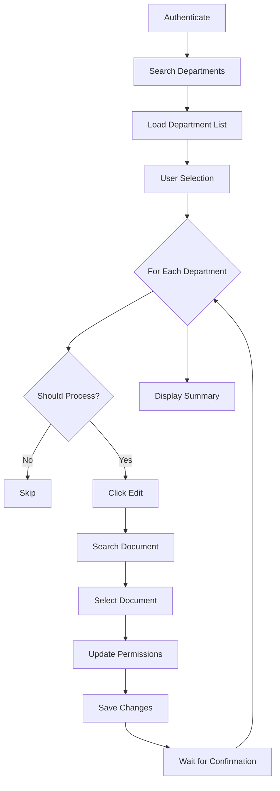

# 📋 Department Configurator

> Mass configuration tool for department permissions and document assignments


## 🎯 Overview

**Department Configurator** is an automation tool that streamlines the process of assigning documents and configuring permissions across multiple departments in a corporate platform. It features an interactive selection interface and robust retry logic for reliable execution.

### Key Features

- ✅ **Interactive Selection** - Choose which departments to process
- ✅ **Batch Configuration** - Apply settings to multiple departments automatically
- ✅ **Retry Logic** - Automatic retry with exponential backoff
- ✅ **Detailed Logging** - Complete audit trail of all operations
- ✅ **Smart Waits** - Handles dynamic page elements reliably
- ✅ **Secure Configuration** - Environment-based credentials

## 📸 Screenshots

*[Add screenshots of the tool in action]*

## 🚀 Quick Start

### Prerequisites

- Python 3.10 or higher
- Google Chrome browser
- Valid credentials for the target platform

### Installation

1. **Clone the repository**
   ```bash
   git clone <repository-url>
   cd department-configurator
   ```

2. **Create virtual environment**
   ```bash
   python -m venv .venv
   .venv\Scripts\activate  # Windows
   # or
   source .venv/bin/activate  # Linux/Mac
   ```

3. **Install dependencies**
   ```bash
   # Install selenium-core library
   pip install -e ../selenium-core
   
   # Install project dependencies
   pip install -r requirements.txt
   ```

4. **Configure environment**
   ```bash
   # Copy example environment file
   copy .env.example .env  # Windows
   # or
   cp .env.example .env  # Linux/Mac
   
   # Edit .env with your credentials
   notepad .env  # Windows
   # or
   nano .env  # Linux/Mac
   ```

### Usage

```bash
python src/main.py
```

The tool will:
1. Open the browser and authenticate
2. Search for departments matching your criteria
3. Display list of found departments
4. Prompt you to select which ones to exclude
5. Process selected departments with document assignment
6. Display summary of results

### Interactive Selection

```
============================================================
DEPARTMENT SELECTION
============================================================
1 - Contábil - Empresa A
2 - Contábil - Empresa B
3 - Contábil - Empresa C
...

Do you want to exclude any departments? (y/n): y
Enter department numbers to exclude (0 to finish):
Department number: 2
✓ Department 2 (Contábil - Empresa B) marked for exclusion
Department number: 0

============================================================
Departments to process: 49
Departments excluded: 1
============================================================
```

## 📊 How It Works



### Process Flow

1. **Authentication** - Logs into the platform
2. **Department Search** - Searches by department name
3. **List Display** - Shows all matching departments
4. **User Selection** - Interactive prompt to exclude departments
5. **Document Assignment** - For each department:
   - Opens edit modal
   - Searches for document
   - Selects document checkbox
   - Updates permissions
   - Saves changes
   - Waits for confirmation
6. **Summary** - Shows processed/failed/skipped counts

## 🛠️ Tech Stack

- **Python 3.10+** - Core language
- **Selenium WebDriver** - Browser automation
- **Pydantic** - Configuration management
- **selenium-core** - Shared automation library

## 📁 Project Structure

```
department-configurator/
├── src/
│   ├── __init__.py
│   ├── main.py                  # Entry point
│   ├── config.py                # Configuration
│   ├── department_service.py    # Department management
│   └── document_manager.py      # Document assignment logic
├── logs/
│   └── YYYYMMDD.log            # Daily logs (auto-generated)
├── screenshots/
│   └── .gitkeep
├── .env.example                 # Environment template
├── .gitignore
├── requirements.txt
└── README.md
```

## ⚙️ Configuration

### Environment Variables

| Variable | Description | Default | Required |
|----------|-------------|---------|----------|
| `APP_URL` | Platform URL | - | ✅ |
| `APP_USERNAME` | Login username | - | ✅ |
| `APP_PASSWORD` | Login password | - | ✅ |
| `DOCUMENT_NAME` | Document to assign | `Contábil - teste` | ✅ |
| `DEPARTMENT_SEARCH` | Department search term | `Contábil` | ✅ |
| `HEADLESS` | Run browser in headless mode | `false` | ❌ |
| `WINDOW_SIZE` | Browser window size | `1920,1080` | ❌ |
| `BLOCK_IMAGES` | Block images (2=yes, 1=no) | `2` | ❌ |

## 🔄 Retry Logic

The tool implements robust retry logic with decorators:

```python
@retry_on_exception(max_attempts=3, delay=2.0)
def assign_document_to_department(...):
    # Automatically retries up to 3 times
    # with 2 second delay between attempts
```

This handles transient issues like:
- Stale element references
- Element not interactable
- Temporary network issues

## 📈 Logging

All operations are logged with timestamps:

```
2024-12-05 11:00:00 - INFO - Processing department 1: Contábil - Empresa A
2024-12-05 11:00:03 - INFO - ✓ Successfully processed Contábil - Empresa A
2024-12-05 11:00:03 - INFO - Processing department 3: Contábil - Empresa C
```

Logs are saved to `logs/YYYYMMDD.log` for audit purposes.

## 🐛 Troubleshooting

### Common Issues

**"Login failed"**
- Verify credentials in `.env`
- Check if platform URL is correct

**"Department not found"**
- Verify `DEPARTMENT_SEARCH` matches department names
- Check if departments exist in platform

**"Document not found"**
- Verify `DOCUMENT_NAME` is correct
- Check if document exists in platform
- Note: Document checkbox index (730) may need adjustment

**"Modal won't close"**
- This is usually handled gracefully
- Check logs for details
- Processing continues even if modal close fails

## 💡 Customization

### Changing Document Selection

The document selection uses a hardcoded index. To change:

1. Inspect the page to find the correct checkbox
2. Update the XPath in `document_manager.py`:

```python
# Line ~95 in document_manager.py
'//*[@id="list-categories"]/li[YOUR_INDEX]/label/input'
```

### Adding More Configuration

Add new settings in `config.py`:

```python
class Settings(BaseSettings):
    # Add your new setting
    MY_NEW_SETTING: str = "default_value"
```

Then use in code:
```python
from .config import settings
value = settings.MY_NEW_SETTING
```

## 🔒 Security Best Practices

- ✅ Credentials stored in `.env` (not tracked by git)
- ✅ `.env.example` provided as template
- ✅ No hardcoded passwords in source code
- ✅ Logs excluded from version control

## 🤝 Contributing

This is a portfolio project, but suggestions and improvements are welcome!

## 📄 License

MIT License - feel free to use this project as reference for your own automation needs.

## 👤 Author

**Wgledston Belizário Silva**
- Portfolio: [studio.worple.com.br]
- LinkedIn: [linkedin.com/in/wgledston]
- GitHub: [github.com/wgledston]

---

**Note**: This tool is designed for legitimate business automation. Always ensure you have proper authorization before automating interactions with any web platform.
